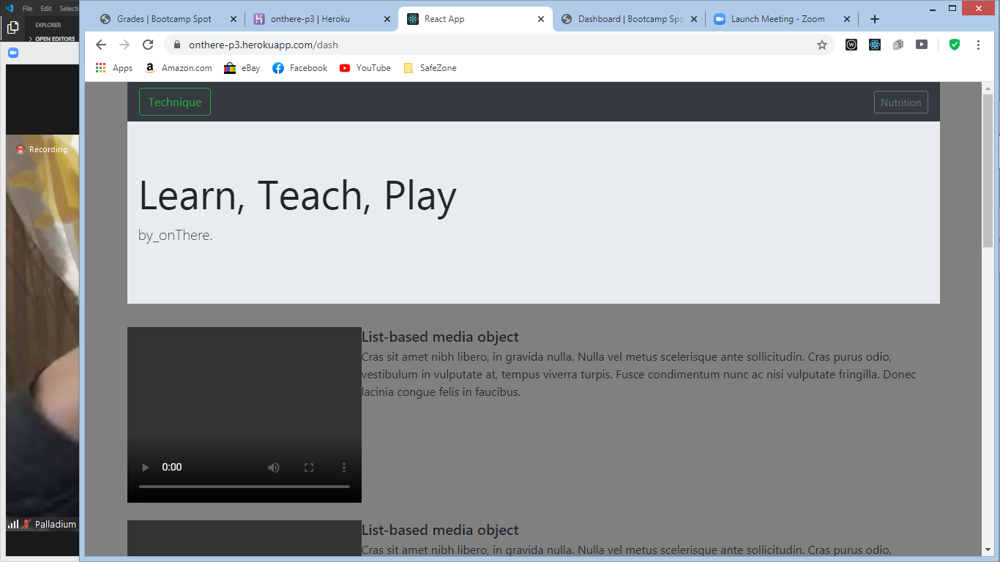

#project3 onThere
Is Skelton site for boxing fans where students and teacher share knowledge connecting them thru youtube API.
The idea is fan can visit learn from the best instructional vid from the best coaches all together free from the youtube site. also tried using Rapid Api to implement on Nutritional page for weight cutting.
Major bugs are api headers need to be wraped in a function to limit to one object. YouTube api was unsuccessfull.

  ##Technologys used for this project 
  
linux
 react js
 node js
 bootstrap
 Rapid api
 Mongod
 bycrypt

When directed to the home/rootpage user is  presented with  all the members of Onthere.  The members will be stacked on top of each other like a news feed. Then the user can browse all profile cards and is able to answer questions and interact with members' profiles .

When the user is on the home page. The user will have and see navbar with two options to create a profile or to search for a profile.

When the user clicks on Nutrition profile he then routed to create profile page where the user is able to create a profile to be shown on the main page.
When creating pr and a section for the  advice from advice slip api
The profile card will also contain a section where the user can post a question for other members to see and a section where other members can input the answers to the question.

User will be able to delete edit their profile question and answers

[this is the link to the page](https://onthere-p3.herokuapp.com/)

